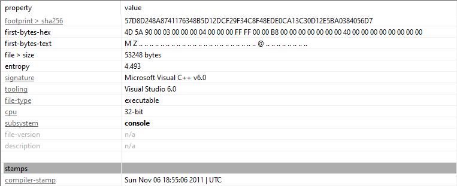
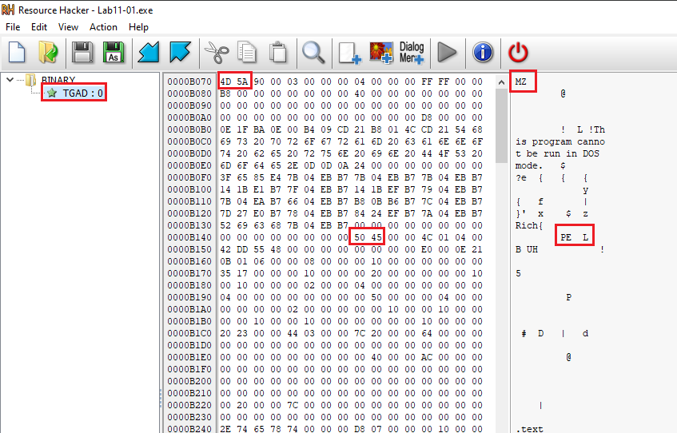
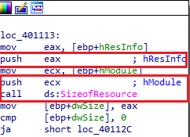
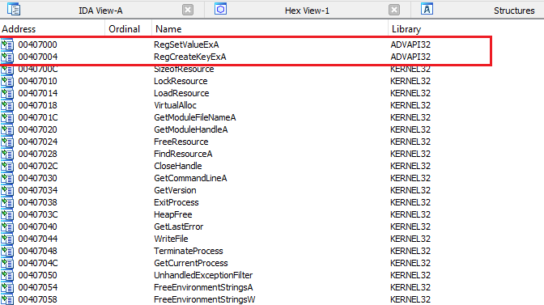
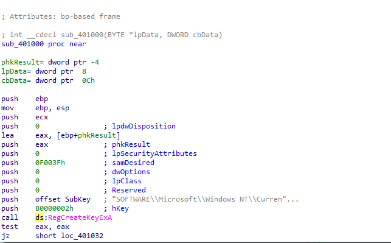

# Lab 11-01 Analysis :

## Basic Analysis Using Pestudio : 

### Check Imports : 
> SizeofResource  
LockResource  
LoadResource  
FreeResource  
FindResourceA  
VirtualFree  
CreateFileA  

So it's obvious that is a **Dropper** 

### Check it's Sections using Resource Hacker : 

we find 32-Bit Executable file 

## Manual Code Review : 
### How Lab 11-01 Drop TGAD.bin : 

- 01 ) Call **FindResourceA**  API  which Return a Handle to specific Resourse’s information Block   
  
- 02 ) Call **LoadResource** API which take **FindResourceA** return value as Parameter & Return a Retrieved Handle to the data associated to a Resource    
  
 - 03 ) Call **LockResource** API which take **LoadResource** return value as Parameter & Called to Optain a Pointer to the actual resource   
   
- 04 ) Call **SizeofResource** API which Determine the size of the Resource  
   
 05) Call **VirtualAlloc** API which allocate space for dropped file    
  
- 06 ) Call **FreeResource** API which unmap allocated space  
   
----
#### How Lab 11-01 perform Persistence : 
 
#### XREFs for any API of them : 

 we find that sample open specific registry key using **RegCreateKeyExA** with Regisrty subkey as parameter & **80000002h** referes to **HKEY_LOCAL_MACHINE**

> Registry Subkey : "SOFTWARE\Microsoft\Windows NT\CurrentVersion\Winlogon"    

### Malware Stole credentials by GINA Interception which is  a dead technique.
