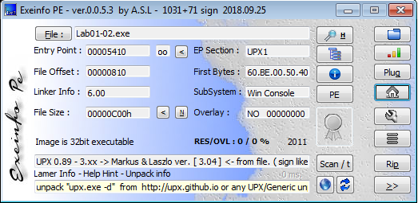
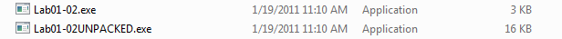
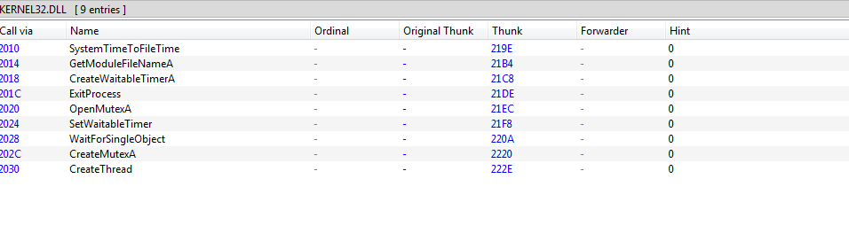
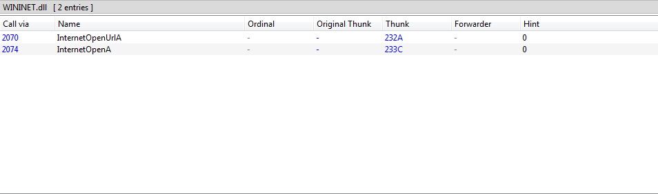
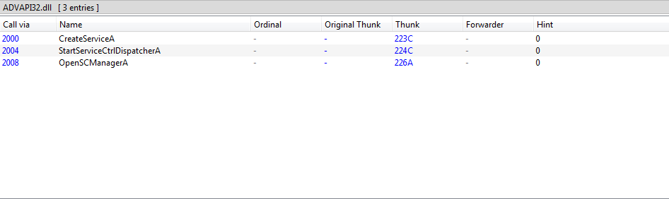
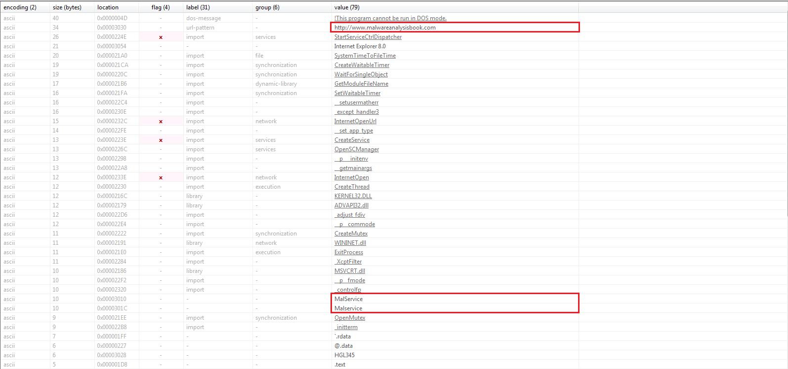

# Lab 1 - 2 Solution :

1. 54 engines detected file as malicious.
2. file is packed using UPX Packer
3. there is interesting imports as CreateService, InternetOpen, and InternetOpenURL.
4. Network-Based Indicator >  http://www.malwareanalysisbook.com  . & Host-Based Indicator > MalService 

## demonstrate lab01-02.exe :

File Hash 
> c876a332d7dd8da331cb8eee7ab7bf32752834d4b2b54eaa362674a2a48f64a6

Searching online by hash 

our sample is detected as a trojan.

Some details about our sample from [VirusTotal](https://www.virustotal.com/gui/home/upload) 
* File type :  Win32 EXE 
* Packed file : UPX compressed 
* Creation Time : 2011-01-19 16:10:41 UTC 
* Imports : ADVAPI32.dll - KERNEL32.DLL - MSVCRT.dll - WININET.dll 

Although we need to do static analysis to make sure about these results .

Using [EXEinfo](https://exeinfo-pe.en.uptodown.com/windows)

 Our sample is packed using the Ultimate Packer for eXecutables (UPX) ,and  [EXEinfo](https://exeinfo-pe.en.uptodown.com/windows) gives a hint to unpack this sample.

Using [EXEinfo](https://exeinfo-pe.en.uptodown.com/windows) hint : 

Check after Unpacking

very quick note that file size become bigger 

 Now we can do our analysis ,by using [PE-bear](https://github.com/hasherezade/pe-bear) check Imports Table 
 

 sample imports 4 functions 
  
* KERNEL32.DLL 

Sample create mutex ,create thread , set timer ,and waiting.

* WININET.DLL

sample connect to URL ,so we need to extract strings to find this URL

* ADVAPI32.DLL 

this indicator that the program uses the registry, so we need to extract strings and search for registry keys.

* MSVCRT.DLL

Extracting strings using [PEStudio](https://www.winitor.com/download2)

we got some Network and Host Based Indicatros from strings 

URL : http://www.malwareanalysisbook.com

Services : MalService 

