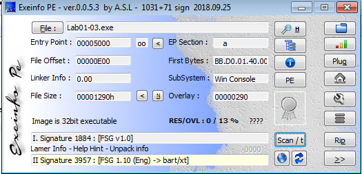
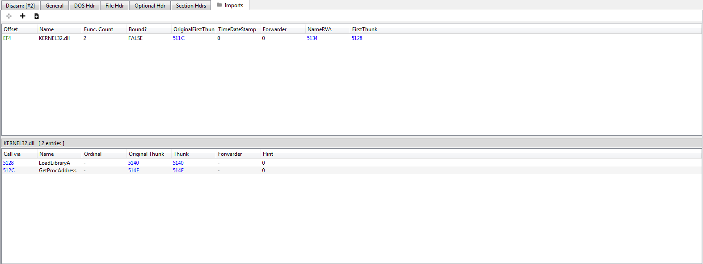
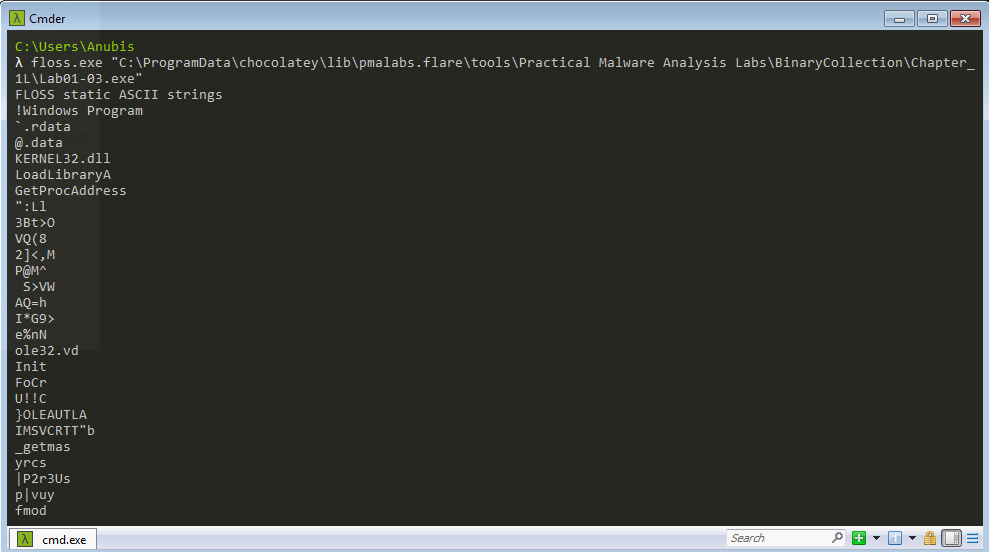

# Lab 1 - 3 Solution :

1. 60 engines detected our sample as malicious.
2. packed with **FSG** Packer
3. Only 2 functios : LoadLibrary and GetProcAddress 
4. there is no indicators that we can get from packed file.

## demonstrate lab01-03.exe :

MD5 Hash : 
> 9c5c27494c28ed0b14853b346b113145

Upload file to [VirusTotal](https://www.virustotal.com/gui/home/upload) 

60 engines detected our sample as malicious.

some details from sandbox scanning :

* File type :  Win32 EXE  
* Packed > Packer: FSG (1.0) 
* Imports : KERNEL32.dll

* 

### Static anslysis 

Upload sample to [EXEinfo](https://exeinfo-pe.en.uptodown.com/windows) 

So Sample is packed with **FSG** Packer ,and So far we can not unpack this file ( PMA book will cover packing in Chapter-18 ), so now we only need to know that there is  Packers more complex than UPX.

Before going to Imports table make sure that there is 2 functions **LoadLibrary** and **GetProcAddress** which Packed files often import only these two functions.

Before extracting strings make sure that will be very few unuseful strings 

so static analysis is Useless when file is packed .