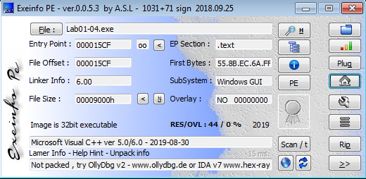
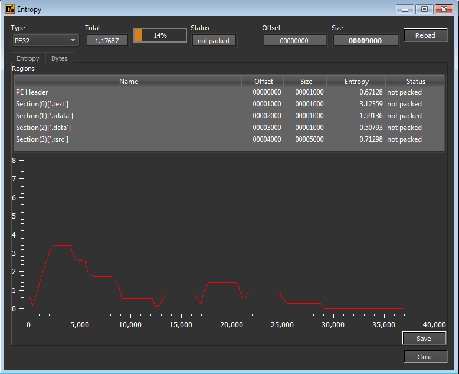
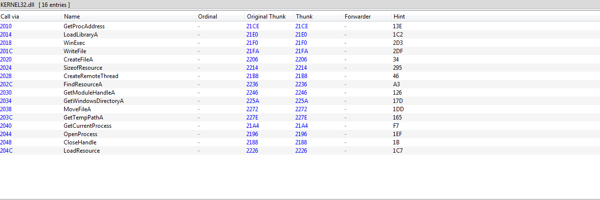
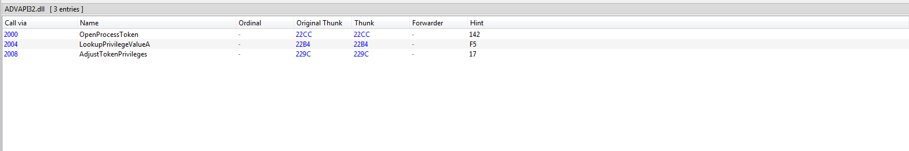
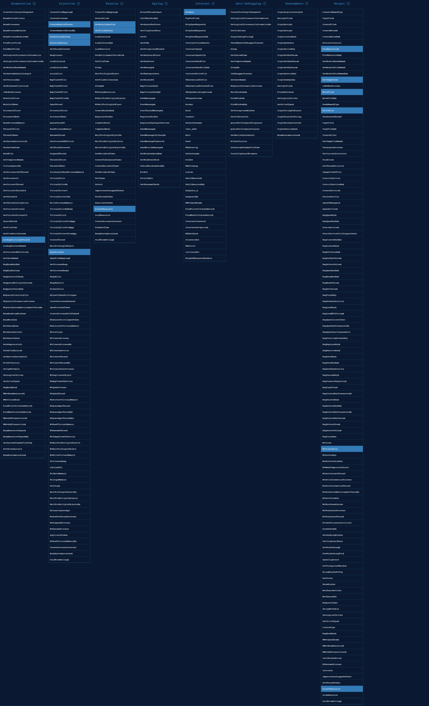

# Lab 1- 4 Solution : 

1. 58 security vendors and 1 sandbox flagged this file as malicious.
2. Not Packed. 
3. Compilation Time : 2019-08-30 22:26:59 UTC 
4. ADVAPI32.DLL , KERNEL32.DLL ,and MSVCRT.DLL
5. file name > psapi.dll & executable name > winlogon.exe &  file path >  \system32\wupdmgr.exe & URL >  http://www.practicalmalwareanalysis.com/updater.exe  .
6. Recouces section contain binary code and program data.

## demonstrate lab01-04.exe :

File Hash : 
> 0fa1498340fca6c562cfa389ad3e93395f44c72fd128d7ba08579a69aaf3b126

Uploading our sample to [VirusTotal](https://www.virustotal.com/gui/home/upload)

58 security vendors and 1 sandbox flagged this file as malicious.

Sandbox Results :
* File type : Win32 EXE
* Compilation Time : 2019-08-30 22:26:59 UTC. 
* Imports : ADVAPI32.dll - KERNEL32.dll - MSVCRT.dll 

### Static Analysis

Upload sample to [EXEinfo](https://exeinfo-pe.en.uptodown.com/windows) :
 

 Entropy view in [DIE](https://github.com/horsicq/Detect-It-Easy)
 

 Sample Not Packed. 

 [PEview](http://wjradburn.com/software/)  >  IMAGE_NT_HEADERS > IMAGE_FILE_HEADER > Time Date Stamp 
 
 file is compiled 2019-08-30 fir 22:26:59 UTC.

 Using [PE-bear](https://github.com/hasherezade/pe-bear)
 
 There is 3 Functions 

#### KERNEL32.DLL 

**FindResourceA** ,**loadResource** ,and **SizeOfResource** refer that our malware loads data from the resource section

**WriteFile**, **CreateFile**, and **MoveFile** refer that our malware manipulate files .

**WinExec** refer that our malware runs files.

#### ADVAPI32.DLL 

this function refers that our malware try to access files with high privilege.

#### MSVCRT.DLL 

 [malAPI](https://malapi.io/#)

Extractins Strings using [PEStudio](https://www.winitor.com/download2)

#### Host-Based Indicators 
* file name > psapi.dll
* executable name > winlogon.exe
* file path >  \system32\wupdmgr.exe 

#### Network-Based Indicators
* URL to download  **second stage**  > http://www.practicalmalwareanalysis.com/updater.exe

Malware download another file called updater.exe from URL : practicalmalwareanalysis.com/updater.exe 
Malware create file called wupdmgr.exe in this path C:Windows\system32\wupdmgr.exe .

